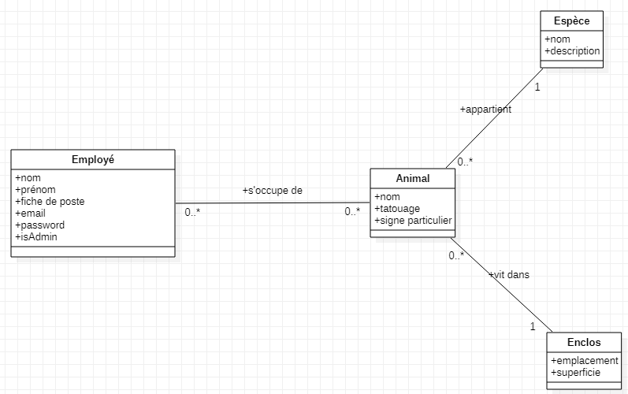

# Challenge Rest Api

Le sujet est la gestion d'un zoo :
- chaque animal appartient à une espèce
- chaque animal vit dans un enclos
- chaque animal peut être soigné par un ou plusieurs employés
- chaque employé peut soigner un ou plusieurs animaux

Vous allez devoir construire une Rest Api dans son intégralité et créer quelques contenus grâce aux différentes routes que vous mettrez en place.

Vous devrez vous reposer sur le diagramme de classes fourni :

Vous devrez donc mettre en place les modèles nécessaires, puis les controllers et les routes

## Fonctionnalités demandées

### Partie 1 (7 points)

- CRUD de `employé`
- Gestion des employés (connexion et création de compte)

### Partie 2 (7 points)

- CRUD `animal`, `espèce` et `enclos`
- mettre en place les relations entre les entités `animal`, `espèce` et `enclos`

### Partie 3 (6 points)

- sécurisation des CRUD : seul un employé avec le rôle admin pourra accéder aux fonctionnalités de suppression et de modification
- mettre en place la relation entre `employé` et `animal`

